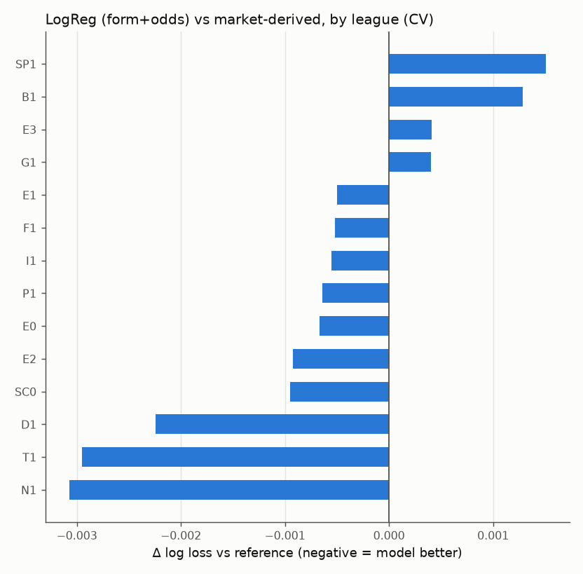
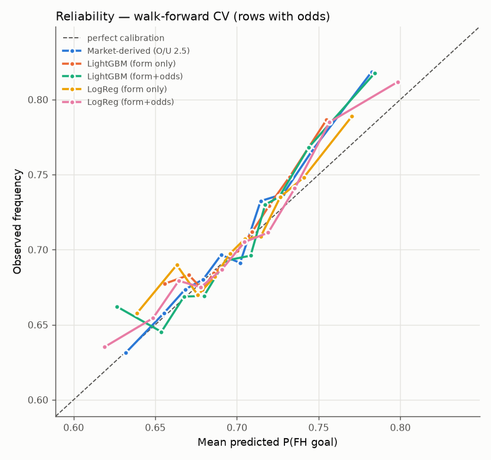
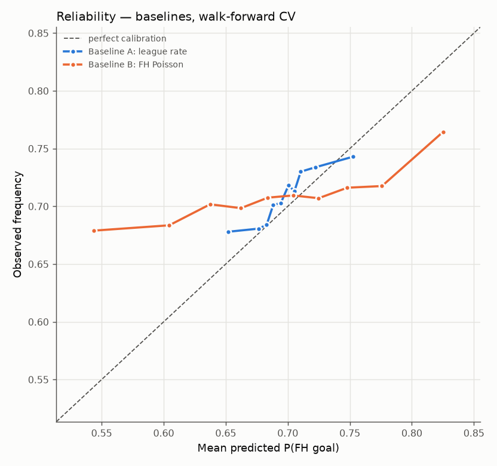
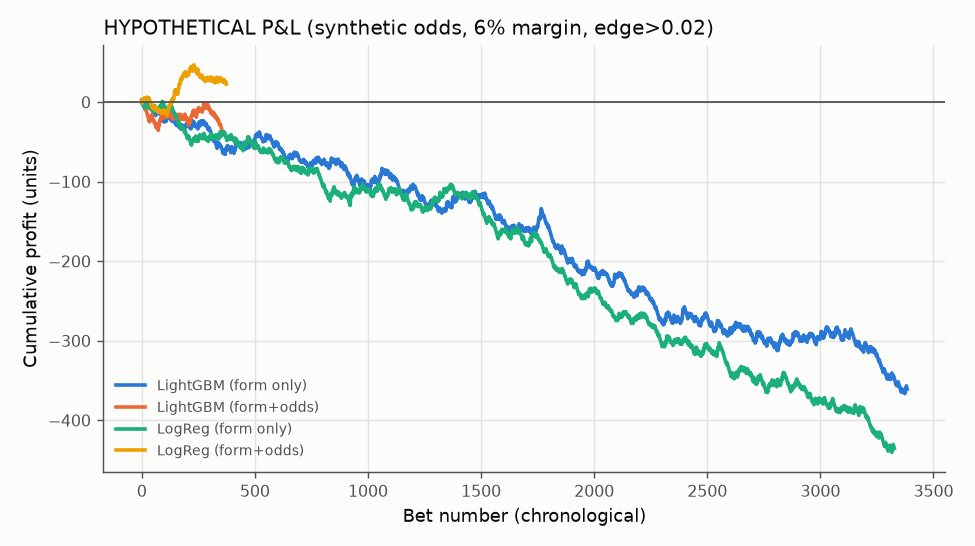

# Backtest report — walk-forward CV (test season NOT evaluated)

Generated 2026-09-28T08:45:03+00:00. Test season `2526` was excluded before any modelling.

## Setup
- CV folds (expanding window): eval `2021` (fit ≤`1819`, early-stop `1920`), eval `2122` (fit ≤`1920`, early-stop `2021`), eval `2223` (fit ≤`2021`, early-stop `2122`), eval `2324` (fit ≤`2122`, early-stop `2223`)
- Out-of-fold rows: 20,891 (with market odds: 20,887)
- Candidates evaluated: 36; best per family by mean CV log loss:
  - **LogReg (form only)**: `logreg[form;N=10;C=0.01]`
  - **LightGBM (form only)**: `lightgbm[form;N=10;learning_rate=0.03,min_child_samples=200,num_leaves=7]`
  - **LogReg (form+odds)**: `logreg[odds;N=10;C=0.01]`
  - **LightGBM (form+odds)**: `lightgbm[odds;N=10;learning_rate=0.03,min_child_samples=200,num_leaves=7]`

## Data coverage (development seasons)
| season | matches | fh_rate | odds_coverage |
|---|---|---|---|
| 1617 | 5,106 | 0.693 | 1.000 |
| 1718 | 5,106 | 0.698 | 1.000 |
| 1819 | 5,106 | 0.695 | 1.000 |
| 1920 | 4,612 | 0.701 | 0.999 |
| 2021 | 5,288 | 0.697 | 1.000 |
| 2122 | 5,246 | 0.703 | 1.000 |
| 2223 | 5,179 | 0.712 | 1.000 |
| 2324 | 5,178 | 0.722 | 1.000 |
| 2425 | 5,132 | 0.708 | 1.000 |

## All out-of-fold rows — models vs baselines
|  | n | log_loss | brier | auc | ece | mean_p | base_rate |
|---|---|---|---|---|---|---|---|
| Baseline A: league rate | 20,891 | 0.6028 | 0.2063 | 0.5297 | 0.0118 | 0.6986 | 0.7085 |
| Baseline B: FH Poisson | 20,891 | 0.6120 | 0.2103 | 0.5264 | 0.0513 | 0.6910 | 0.7085 |
| LightGBM (form only) | 20,891 | 0.6009 | 0.2055 | 0.5447 | 0.0104 | 0.7000 | 0.7085 |
| LightGBM (form+odds) | 20,891 | 0.5976 | 0.2042 | 0.5683 | 0.0147 | 0.7000 | 0.7085 |
| LogReg (form only) | 20,891 | 0.6004 | 0.2053 | 0.5484 | 0.0100 | 0.7017 | 0.7085 |
| LogReg (form+odds) | 20,891 | 0.5965 | 0.2038 | 0.5718 | 0.0100 | 0.7015 | 0.7085 |

Paired block-bootstrap (by date) of Δ log loss = model − reference (negative = model better):

| model | reference | delta | ci_low | ci_high | verdict |
|---|---|---|---|---|---|
| LightGBM (form only) | Baseline A: league rate | -0.00195 | -0.00279 | -0.00111 | BEATS reference (95% CI entirely below 0) |
| LightGBM (form only) | Baseline B: FH Poisson | -0.01116 | -0.01333 | -0.00896 | BEATS reference (95% CI entirely below 0) |
| LightGBM (form+odds) | Baseline A: league rate | -0.00522 | -0.00646 | -0.00406 | BEATS reference (95% CI entirely below 0) |
| LightGBM (form+odds) | Baseline B: FH Poisson | -0.01443 | -0.01660 | -0.01232 | BEATS reference (95% CI entirely below 0) |
| LogReg (form only) | Baseline A: league rate | -0.00241 | -0.00344 | -0.00140 | BEATS reference (95% CI entirely below 0) |
| LogReg (form only) | Baseline B: FH Poisson | -0.01162 | -0.01379 | -0.00955 | BEATS reference (95% CI entirely below 0) |
| LogReg (form+odds) | Baseline A: league rate | -0.00631 | -0.00777 | -0.00502 | BEATS reference (95% CI entirely below 0) |
| LogReg (form+odds) | Baseline B: FH Poisson | -0.01552 | -0.01783 | -0.01340 | BEATS reference (95% CI entirely below 0) |

## Rows with bookmaker odds — models vs market-derived benchmark
The market benchmark is **DERIVED**, not a quoted FH price: λ from de-vigged O/U 2.5, p = 1 − exp(−s·λ) with s fitted on each fold's training seasons.

|  | n | log_loss | brier | auc | ece | mean_p | base_rate |
|---|---|---|---|---|---|---|---|
| Market-derived (O/U 2.5) | 20,887 | 0.5972 | 0.2040 | 0.5704 | 0.0109 | 0.6999 | 0.7085 |
| Baseline A: league rate | 20,887 | 0.6028 | 0.2063 | 0.5298 | 0.0118 | 0.6986 | 0.7085 |
| Baseline B: FH Poisson | 20,887 | 0.6120 | 0.2103 | 0.5265 | 0.0512 | 0.6910 | 0.7085 |
| LightGBM (form only) | 20,887 | 0.6009 | 0.2055 | 0.5448 | 0.0104 | 0.7000 | 0.7085 |
| LightGBM (form+odds) | 20,887 | 0.5976 | 0.2042 | 0.5683 | 0.0148 | 0.7000 | 0.7085 |
| LogReg (form only) | 20,887 | 0.6004 | 0.2053 | 0.5484 | 0.0100 | 0.7017 | 0.7085 |
| LogReg (form+odds) | 20,887 | 0.5965 | 0.2038 | 0.5718 | 0.0099 | 0.7015 | 0.7085 |

| model | reference | delta | ci_low | ci_high | verdict |
|---|---|---|---|---|---|
| LightGBM (form only) | Market-derived (O/U 2.5) | 0.00373 | 0.00276 | 0.00473 | WORSE than reference (95% CI entirely above 0) |
| LightGBM (form+odds) | Market-derived (O/U 2.5) | 0.00046 | -0.00004 | 0.00097 | no significant difference (95% CI spans 0) |
| LogReg (form only) | Market-derived (O/U 2.5) | 0.00327 | 0.00227 | 0.00426 | WORSE than reference (95% CI entirely above 0) |
| LogReg (form+odds) | Market-derived (O/U 2.5) | -0.00063 | -0.00116 | -0.00012 | BEATS reference (95% CI entirely below 0) |

## Per-league log loss (CV, rows with odds)
| div | n | base_rate | Market-derived (O/U 2.5) | Baseline A: league rate | LightGBM (form only) | LightGBM (form+odds) | LogReg (form only) | LogReg (form+odds) |
|---|---|---|---|---|---|---|---|---|
| B1 | 1,226 | 0.7390 | 0.5696 | 0.5756 | 0.5740 | 0.5698 | 0.5749 | 0.5709 |
| D1 | 1,224 | 0.7565 | 0.5440 | 0.5554 | 0.5528 | 0.5426 | 0.5517 | 0.5418 |
| E0 | 1,520 | 0.7303 | 0.5748 | 0.5841 | 0.5818 | 0.5766 | 0.5815 | 0.5741 |
| E1 | 2,208 | 0.6698 | 0.6306 | 0.6350 | 0.6335 | 0.6316 | 0.6325 | 0.6301 |
| E2 | 2,208 | 0.7097 | 0.6012 | 0.6033 | 0.6022 | 0.6008 | 0.6025 | 0.6002 |
| E3 | 2,207 | 0.6919 | 0.6137 | 0.6178 | 0.6173 | 0.6140 | 0.6168 | 0.6141 |
| F1 | 1,446 | 0.7213 | 0.5857 | 0.5934 | 0.5916 | 0.5864 | 0.5908 | 0.5852 |
| G1 | 958 | 0.6879 | 0.6153 | 0.6258 | 0.6205 | 0.6158 | 0.6221 | 0.6157 |
| I1 | 1,518 | 0.7240 | 0.5862 | 0.5898 | 0.5887 | 0.5857 | 0.5867 | 0.5857 |
| N1 | 1,224 | 0.7353 | 0.5699 | 0.5792 | 0.5733 | 0.5700 | 0.5718 | 0.5668 |
| P1 | 1,224 | 0.6928 | 0.6132 | 0.6171 | 0.6117 | 0.6140 | 0.6118 | 0.6125 |
| SC0 | 912 | 0.7105 | 0.5949 | 0.6022 | 0.5983 | 0.5965 | 0.5969 | 0.5940 |
| SP1 | 1,520 | 0.6645 | 0.6378 | 0.6382 | 0.6399 | 0.6387 | 0.6403 | 0.6393 |
| T1 | 1,492 | 0.7212 | 0.5862 | 0.5923 | 0.5919 | 0.5873 | 0.5911 | 0.5832 |

## Calibration
Model fitted on seasons before the calibration season; calibrator chosen by fitting on the first half of the calibration season and scoring the second half, then refitted on the full season.

| model | raw_logloss_on_cal_season | chosen_calibration | holdout_ll_none | holdout_ll_platt | holdout_ll_isotonic | market_s |
|---|---|---|---|---|---|---|
| LightGBM (form only) | 0.5977 | isotonic | 0.6045 | 0.6040 | 0.6035 | 0.4500 |
| LightGBM (form+odds) | 0.5934 | platt | 0.6001 | 0.5995 | 0.6399 | 0.4500 |
| LogReg (form only) | 0.5984 | none | 0.6062 | 0.6065 | 0.6205 | 0.4500 |
| LogReg (form+odds) | 0.5932 | platt | 0.6002 | 0.6002 | 0.6041 | 0.4500 |

## Betting simulation — HYPOTHETICAL
**No real first-half O/U 0.5 odds exist in this dataset.** Bets are priced at SYNTHETIC odds = 1 / (p_market_derived × (1 + 0.06)). Because the price is itself derived from the market benchmark, this only shows whether the model disagrees with the market profitably *under that assumption*. It is not evidence of a real-world edge. Informational only.

| model | threshold | n_bets | roi | roi_ci_low | roi_ci_high | max_drawdown | mean_odds |
|---|---|---|---|---|---|---|---|
| LightGBM (form only) | 0.020 | 3,385 | -0.107 | -0.156 | -0.052 | 368.050 | 3.552 |
| LightGBM (form only) | 0.040 | 1,178 | -0.147 | -0.233 | -0.049 | 180.052 | 3.993 |
| LightGBM (form only) | 0.060 | 338 | -0.286 | -0.452 | -0.120 | 96.831 | 4.501 |
| LightGBM (form+odds) | 0.020 | 355 | -0.098 | -0.240 | 0.070 | 38.323 | 3.731 |
| LightGBM (form+odds) | 0.040 | 41 | -0.629 | -0.928 | -0.225 | 28.479 | 5.104 |
| LightGBM (form+odds) | 0.060 | 7 | -1.000 | -1.000 | -1.000 | 7.000 | 6.696 |
| LogReg (form only) | 0.020 | 3,328 | -0.131 | -0.180 | -0.082 | 443.296 | 3.334 |
| LogReg (form only) | 0.040 | 1,215 | -0.134 | -0.218 | -0.049 | 169.834 | 3.652 |
| LogReg (form only) | 0.060 | 379 | -0.103 | -0.261 | 0.067 | 53.659 | 3.967 |
| LogReg (form+odds) | 0.020 | 375 | 0.060 | -0.074 | 0.198 | 24.121 | 2.837 |
| LogReg (form+odds) | 0.040 | 126 | 0.113 | -0.091 | 0.338 | 14.961 | 2.556 |
| LogReg (form+odds) | 0.060 | 57 | 0.146 | -0.137 | 0.446 | 6.000 | 2.372 |

## Verdict (computed from the numbers above)
Caveat: the four models were each selected as the best of 9 candidates on these same CV folds, so their CV scores (and deltas) are slightly optimistic. Baselines and the market benchmark involve no selection. The untouched test season is the honest check.

- LightGBM (form only) vs Baseline A: league rate: Δ=-0.00195 [-0.00279, -0.00111] → BEATS reference (95% CI entirely below 0)
- LightGBM (form only) vs Baseline B: FH Poisson: Δ=-0.01116 [-0.01333, -0.00896] → BEATS reference (95% CI entirely below 0)
- LightGBM (form+odds) vs Baseline A: league rate: Δ=-0.00522 [-0.00646, -0.00406] → BEATS reference (95% CI entirely below 0)
- LightGBM (form+odds) vs Baseline B: FH Poisson: Δ=-0.01443 [-0.01660, -0.01232] → BEATS reference (95% CI entirely below 0)
- LogReg (form only) vs Baseline A: league rate: Δ=-0.00241 [-0.00344, -0.00140] → BEATS reference (95% CI entirely below 0)
- LogReg (form only) vs Baseline B: FH Poisson: Δ=-0.01162 [-0.01379, -0.00955] → BEATS reference (95% CI entirely below 0)
- LogReg (form+odds) vs Baseline A: league rate: Δ=-0.00631 [-0.00777, -0.00502] → BEATS reference (95% CI entirely below 0)
- LogReg (form+odds) vs Baseline B: FH Poisson: Δ=-0.01552 [-0.01783, -0.01340] → BEATS reference (95% CI entirely below 0)
- LightGBM (form only) vs Market-derived (O/U 2.5): Δ=+0.00373 [+0.00276, +0.00473] → WORSE than reference (95% CI entirely above 0)
- LightGBM (form+odds) vs Market-derived (O/U 2.5): Δ=+0.00046 [-0.00004, +0.00097] → no significant difference (95% CI spans 0)
- LogReg (form only) vs Market-derived (O/U 2.5): Δ=+0.00327 [+0.00227, +0.00426] → WORSE than reference (95% CI entirely above 0)
- LogReg (form+odds) vs Market-derived (O/U 2.5): Δ=-0.00063 [-0.00116, -0.00012] → BEATS reference (95% CI entirely below 0)
