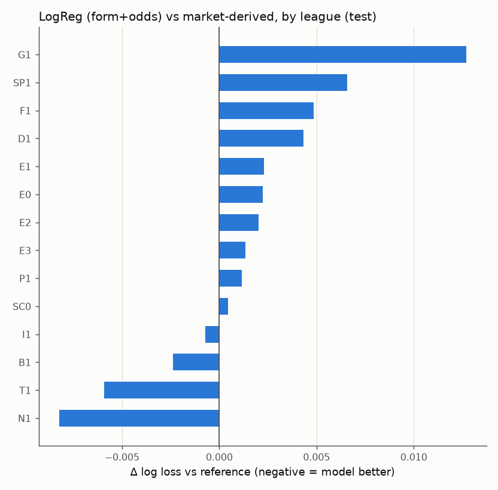
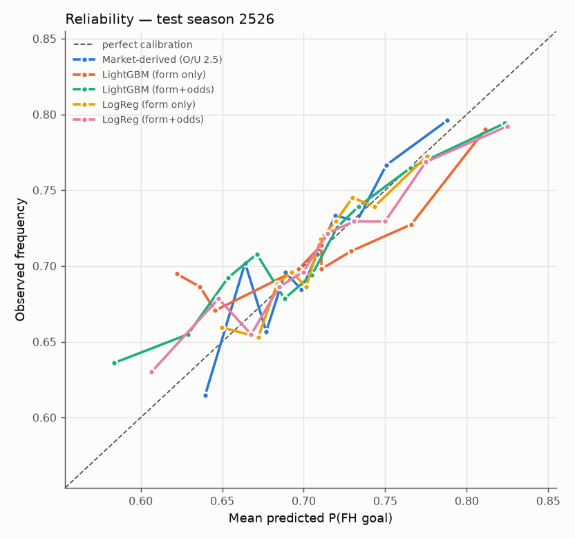

# Test-season evaluation — 2526 (run once)

Generated 2026-09-28T09:33:45+00:00 at commit `8618ed1ac6`. Bundles fitted on seasons up to `2324`, calibrated on `2425`; nothing was fitted or tuned on the test season.

## Pre-registered primary comparison
**LogReg (form+odds) vs market-derived benchmark** (chosen from the backtest before this season was seen).

- Backtest (CV): Δ log loss = -0.00063 [-0.00116, -0.00012]
- **Test: Δ log loss = +0.00145 [-0.00059, +0.00396]** (95% CI spans 0; n = 5,101)

> **Interpretation (auto-generated from the CI):** Cannot confirm backtest edge. Forward testing is the tiebreaker. Do not adjust the model.

## All test rows — models vs baselines
|  | n | log_loss | brier | auc | ece | mean_p | base_rate |
|---|---|---|---|---|---|---|---|
| Baseline A: league rate | 5,101 | 0.6022 | 0.2060 | 0.5200 | 0.0208 | 0.7037 | 0.7087 |
| Baseline B: FH Poisson | 5,101 | 0.6125 | 0.2103 | 0.5246 | 0.0521 | 0.6901 | 0.7087 |
| LightGBM (form only) | 5,101 | 0.6037 | 0.2067 | 0.5339 | 0.0256 | 0.7040 | 0.7087 |
| LightGBM (form+odds) | 5,101 | 0.5996 | 0.2050 | 0.5615 | 0.0215 | 0.6973 | 0.7087 |
| LogReg (form only) | 5,101 | 0.6002 | 0.2051 | 0.5510 | 0.0092 | 0.7079 | 0.7087 |
| LogReg (form+odds) | 5,101 | 0.5991 | 0.2046 | 0.5637 | 0.0140 | 0.7102 | 0.7087 |

| model | reference | delta | ci_low | ci_high | verdict |
|---|---|---|---|---|---|
| LightGBM (form only) | Baseline A: league rate | 0.00142 | -0.00194 | 0.00453 | no significant difference (95% CI spans 0) |
| LightGBM (form only) | Baseline B: FH Poisson | -0.00881 | -0.01275 | -0.00465 | BEATS reference (95% CI entirely below 0) |
| LightGBM (form+odds) | Baseline A: league rate | -0.00262 | -0.00629 | 0.00066 | no significant difference (95% CI spans 0) |
| LightGBM (form+odds) | Baseline B: FH Poisson | -0.01286 | -0.01745 | -0.00833 | BEATS reference (95% CI entirely below 0) |
| LogReg (form only) | Baseline A: league rate | -0.00205 | -0.00421 | 0.00049 | no significant difference (95% CI spans 0) |
| LogReg (form only) | Baseline B: FH Poisson | -0.01228 | -0.01632 | -0.00835 | BEATS reference (95% CI entirely below 0) |
| LogReg (form+odds) | Baseline A: league rate | -0.00311 | -0.00673 | 0.00041 | no significant difference (95% CI spans 0) |
| LogReg (form+odds) | Baseline B: FH Poisson | -0.01334 | -0.01871 | -0.00864 | BEATS reference (95% CI entirely below 0) |

## Rows with odds — models vs market-derived benchmark (DERIVED, not a quoted FH price)
|  | n | log_loss | brier | auc | ece | mean_p | base_rate |
|---|---|---|---|---|---|---|---|
| Market-derived (O/U 2.5) | 5,101 | 0.5977 | 0.2042 | 0.5636 | 0.0146 | 0.7067 | 0.7087 |
| Baseline A: league rate | 5,101 | 0.6022 | 0.2060 | 0.5200 | 0.0208 | 0.7037 | 0.7087 |
| Baseline B: FH Poisson | 5,101 | 0.6125 | 0.2103 | 0.5246 | 0.0521 | 0.6901 | 0.7087 |
| LightGBM (form only) | 5,101 | 0.6037 | 0.2067 | 0.5339 | 0.0256 | 0.7040 | 0.7087 |
| LightGBM (form+odds) | 5,101 | 0.5996 | 0.2050 | 0.5615 | 0.0215 | 0.6973 | 0.7087 |
| LogReg (form only) | 5,101 | 0.6002 | 0.2051 | 0.5510 | 0.0092 | 0.7079 | 0.7087 |
| LogReg (form+odds) | 5,101 | 0.5991 | 0.2046 | 0.5637 | 0.0140 | 0.7102 | 0.7087 |

| model | reference | delta | ci_low | ci_high | verdict |
|---|---|---|---|---|---|
| LightGBM (form only) | Market-derived (O/U 2.5) | 0.00598 | 0.00294 | 0.00903 | WORSE than reference (95% CI entirely above 0) |
| LightGBM (form+odds) | Market-derived (O/U 2.5) | 0.00193 | 0.00001 | 0.00377 | WORSE than reference (95% CI entirely above 0) |
| LogReg (form only) | Market-derived (O/U 2.5) | 0.00250 | 0.00034 | 0.00520 | WORSE than reference (95% CI entirely above 0) |
| LogReg (form+odds) | Market-derived (O/U 2.5) | 0.00145 | -0.00059 | 0.00396 | no significant difference (95% CI spans 0) |

## Per-league log loss (test)
| div | n | base_rate | Market-derived (O/U 2.5) | Baseline A: league rate | LightGBM (form only) | LightGBM (form+odds) | LogReg (form only) | LogReg (form+odds) |
|---|---|---|---|---|---|---|---|---|
| B1 | 311 | 0.7074 | 0.5954 | 0.6053 | 0.5991 | 0.5905 | 0.5999 | 0.5930 |
| D1 | 306 | 0.7680 | 0.5341 | 0.5423 | 0.5330 | 0.5327 | 0.5431 | 0.5384 |
| E0 | 380 | 0.7158 | 0.5944 | 0.5971 | 0.6024 | 0.5960 | 0.5982 | 0.5967 |
| E1 | 552 | 0.7156 | 0.5995 | 0.5998 | 0.6131 | 0.6032 | 0.6016 | 0.6018 |
| E2 | 552 | 0.7011 | 0.6077 | 0.6101 | 0.6170 | 0.6117 | 0.6102 | 0.6098 |
| E3 | 552 | 0.6703 | 0.6338 | 0.6345 | 0.6318 | 0.6326 | 0.6318 | 0.6351 |
| F1 | 306 | 0.6993 | 0.6135 | 0.6118 | 0.6124 | 0.6180 | 0.6123 | 0.6184 |
| G1 | 236 | 0.7076 | 0.6077 | 0.6093 | 0.6175 | 0.6301 | 0.6129 | 0.6204 |
| I1 | 380 | 0.6553 | 0.6414 | 0.6507 | 0.6467 | 0.6413 | 0.6423 | 0.6406 |
| N1 | 306 | 0.8072 | 0.4885 | 0.4993 | 0.4931 | 0.4833 | 0.4921 | 0.4802 |
| P1 | 306 | 0.6895 | 0.6161 | 0.6197 | 0.6273 | 0.6144 | 0.6209 | 0.6173 |
| SC0 | 228 | 0.7632 | 0.5516 | 0.5532 | 0.5637 | 0.5606 | 0.5535 | 0.5521 |
| SP1 | 380 | 0.7000 | 0.6022 | 0.6132 | 0.6058 | 0.6081 | 0.6054 | 0.6087 |
| T1 | 306 | 0.6797 | 0.6227 | 0.6304 | 0.6298 | 0.6190 | 0.6237 | 0.6168 |

## Calibration: raw vs calibrated on the test season
|  | raw_log_loss | calibrated_log_loss | raw_ece | calibrated_ece | method |
|---|---|---|---|---|---|
| LightGBM (form only) | 0.6006 | 0.6037 | 0.0153 | 0.0256 | isotonic |
| LightGBM (form+odds) | 0.5985 | 0.5996 | 0.0148 | 0.0215 | platt |
| LogReg (form only) | 0.6002 | 0.6002 | 0.0092 | 0.0092 | none |
| LogReg (form+odds) | 0.5985 | 0.5991 | 0.0098 | 0.0140 | platt |

## Betting simulation — HYPOTHETICAL
**No real FH O/U 0.5 odds.** Synthetic odds = 1 / (p_market_derived × (1 + 0.06)). Informational only; not evidence of a real-world edge.

| model | threshold | n_bets | roi | roi_ci_low | roi_ci_high | max_drawdown | mean_odds |
|---|---|---|---|---|---|---|---|
| LightGBM (form only) | 0.020 | 1,546 | -0.037 | -0.106 | 0.027 | 147.510 | 2.855 |
| LightGBM (form only) | 0.040 | 759 | -0.016 | -0.118 | 0.090 | 80.978 | 2.986 |
| LightGBM (form only) | 0.060 | 307 | -0.015 | -0.185 | 0.160 | 42.864 | 3.097 |
| LightGBM (form+odds) | 0.020 | 809 | -0.030 | -0.122 | 0.062 | 67.573 | 2.899 |
| LightGBM (form+odds) | 0.040 | 331 | 0.013 | -0.135 | 0.161 | 19.507 | 2.840 |
| LightGBM (form+odds) | 0.060 | 126 | -0.051 | -0.286 | 0.178 | 12.932 | 2.759 |
| LogReg (form only) | 0.020 | 831 | -0.020 | -0.125 | 0.088 | 52.249 | 3.351 |
| LogReg (form only) | 0.040 | 287 | -0.039 | -0.216 | 0.148 | 34.064 | 3.626 |
| LogReg (form only) | 0.060 | 90 | -0.019 | -0.362 | 0.312 | 17.813 | 3.666 |
| LogReg (form+odds) | 0.020 | 248 | -0.039 | -0.180 | 0.116 | 21.305 | 2.645 |
| LogReg (form+odds) | 0.040 | 53 | -0.047 | -0.341 | 0.283 | 14.188 | 2.460 |
| LogReg (form+odds) | 0.060 | 30 | -0.017 | -0.402 | 0.358 | 6.206 | 2.358 |

## All verdicts (computed)
- LightGBM (form only) vs Baseline A: league rate: Δ=+0.00142 [-0.00194, +0.00453] → no significant difference (95% CI spans 0)
- LightGBM (form only) vs Baseline B: FH Poisson: Δ=-0.00881 [-0.01275, -0.00465] → BEATS reference (95% CI entirely below 0)
- LightGBM (form+odds) vs Baseline A: league rate: Δ=-0.00262 [-0.00629, +0.00066] → no significant difference (95% CI spans 0)
- LightGBM (form+odds) vs Baseline B: FH Poisson: Δ=-0.01286 [-0.01745, -0.00833] → BEATS reference (95% CI entirely below 0)
- LogReg (form only) vs Baseline A: league rate: Δ=-0.00205 [-0.00421, +0.00049] → no significant difference (95% CI spans 0)
- LogReg (form only) vs Baseline B: FH Poisson: Δ=-0.01228 [-0.01632, -0.00835] → BEATS reference (95% CI entirely below 0)
- LogReg (form+odds) vs Baseline A: league rate: Δ=-0.00311 [-0.00673, +0.00041] → no significant difference (95% CI spans 0)
- LogReg (form+odds) vs Baseline B: FH Poisson: Δ=-0.01334 [-0.01871, -0.00864] → BEATS reference (95% CI entirely below 0)
- LightGBM (form only) vs Market-derived (O/U 2.5): Δ=+0.00598 [+0.00294, +0.00903] → WORSE than reference (95% CI entirely above 0)
- LightGBM (form+odds) vs Market-derived (O/U 2.5): Δ=+0.00193 [+0.00001, +0.00377] → WORSE than reference (95% CI entirely above 0)
- LogReg (form only) vs Market-derived (O/U 2.5): Δ=+0.00250 [+0.00034, +0.00520] → WORSE than reference (95% CI entirely above 0)
- LogReg (form+odds) vs Market-derived (O/U 2.5): Δ=+0.00145 [-0.00059, +0.00396] → no significant difference (95% CI spans 0)
